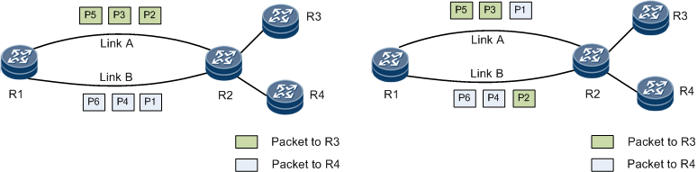

<!--Copyright © ZOMI 适用于[License](https://github.com/Infrasys-AI/AIInfra)版权许可-->

# 负载均衡

author by: 张万豪

## 负载均衡的概念

**负载均衡的概念**

负载均衡（Load Balancing）是指将网络流量、计算任务或工作负载等资源请求，智能地分配到多个后端服务器、计算资源或网络路径上，以提高资源利用率、避免单点故障，从而提升整个系统的性能与可靠性。其本质是解决资源分配的不均衡问题。

负载均衡技术可以通过专用的硬件设备（如硬件负载均衡器）或纯软件解决方案来实现。在网络层面，负载均衡依赖于特定的算法来决定流量路径，而其中最常用和最基础的算法之一就是 **ECMP (Equal-Cost Multi-Path，等价多路径路由)**。然而，这种传统技术在面对现代 AI 集群的独特需求时，正暴露出严重的局限性。

有专用的负载均衡器：

**AI 集群中的网络流量模式**

AI 集群中的网络流量模式与传统数据中心有显著的区别。传统数据中心通常处理大量、短小、随机的“老鼠流”（Mice Flows），例如网页浏览请求。而 AI 训练，尤其是集合通信操作（如 All-reduce、All-to-All），会产生数量较少但带宽极高、持续时间长的**“大象流”（Elephant Flows）**。这些大象流具有高度的同步性和周期性，流量模式相对固定。另外，相较于传统数据中心，AI 训练中会依赖计算节点之间的频繁数据交换，网络中的拥塞、丢包、延迟抖动都会导致 GPU 等计算单元的等待，所以对低延迟、高吞吐有更高的要求。

另外，要理解负载均衡的各种算法，我们还需要理解网络中**数据包 (Packet)** 和 **流 (Flow)**的概念

- **数据包 (Packet):** 在 TCP/IP 网络中，Packet 是最基本的数据传输单元。它通常对应于**IP 分组（或称数据报）**，也就是数据在**网络层（L3）**上传输的实体。网络中的路由器和交换机（三层交换机）的主要工作就是根据 IP 头中的地址信息来转发这些独立的数据包。
- **流 (Flow):** “流”是一个更高级别的逻辑概念。对网络设备（如路由器或负载均衡器）而言，**“流”是共享某些特定属性的一系列数据包 (Packet) 的序列**。最常见的定义“流”的属性就是**“五元组”**（源IP、目的IP、源端口、目的端口、协议号）。例如，你发起的一个 TCP 连接（如一次网页请求或一次 `GPU-1`到`GPU-2`的数据块传输）所产生的所有数据包，都共享相同的五元组，因此它们同属于一个“流”。

如下图所示，在 Per-Flow 模式下，不同颜色的“流”被完整地、块状地分配到不同路径上；而在 Per-Packet 模式下，所有路径上都混杂着所有颜色的“包”

## AI集群中大象流的产生

下面让我们看看AI集群中的“大象流”是怎么产生的。AI 模型的训练遵循一个“前向传播、损失计算、反向传播、参数更新”的循环。然而，对于 GPT-4 这样的巨型模型和海量数据，仅靠单块 GPU 训练可能耗时数年。为了急剧加速这个过程，数据并行（Data Parallelism） 成为了标准策略。 

数据并行的核心思想很简单：**将完全相同的模型副本部署到多个 GPU 上，再将训练数据切分成多份，让所有 GPU 并行计算各自数据份上的梯度。** 但真正的挑战发生在参数更新之前：所有 GPU 必须“达成共识”。它们必须通过一个名为 **All-reduce 的网络通信操作**，来**同步（即汇总并平均）**各自计算出的梯度。待所有 GPU 都获得这个完全相同的“平均梯度”后，它们才会各自更新本地的模型副本，从而确保所有模型在下一次迭代开始前保持一致。

 **而“大象流”，正是在这个 All-reduce 阶段，由 NCCL 这样的通信库为追求极致效率而“有意制造”出来的。**由于梯度数据总量可达数百 GB，NCCL 会将其切分成多个大块（Chunks）。随后，它指挥所有 GPU 在同一时刻，使用 GPUDirect RDMA 技术（绕过CPU，从显存直通网卡），并发地向彼此高速传输这些数据块。 从网络的视角来看，每一个这样的大块数据传输，都是一条持续时间长、占用带宽极高的流。由于这种传输是全局并发的（例如 64 个 GPU 同时爆发），网络中便会瞬间涌入大量并行的**“大象流”**，这对网络负载均衡和拥塞控制提出了严峻的考验。

## 静态哈希负载均衡 (ECMP) 原理

ECMP (Equal-Cost Multi-Path)，即等价多路径路由，是传统数据中心网络中最基础的负载均衡技术。其核心思想是，当交换机发现有多条成本（“Cost”，如跳数或带宽）相同的路径可以到达同一个目的地时，它会试图将流量“均摊”到所有这些路径上。

ECMP 的工作机制是基于“静态哈希”的，并且以“流”（Flow）为单位进行转发决策。具体流程如下：

1. **提取元组：** 当一个数据包到达交换机时，交换机硬件会从包头中提取关键字段，通常是“五元组”（源IP、目的IP、源端口、目的端口、协议号）。
2. **执行哈希：** 交换机使用一个固定的哈希算法（如 CRC）对这个五元组进行计算，得出一个哈希值。
3. **选择路径：** 交换机将这个哈希值对可用的等价路径数量进行取模（Modulo）运算（例如：`哈希值 % 路径数 = 路径索引`），从而为这个“流”选定一条唯一的物理路径。

**关键特性：** 由于同一个“流”（例如一个 TCP 连接）的所有数据包五元组都完全相同，它们计算出的哈希值也永远相同。因此，**一个流的所有数据包都会被固定地发送到同一条路径上**。这样做的好处是保证了数据包的顺序，避免了乱序。

**在 AI 集群中的致命缺陷：** 这种机制在面对 AI 训练负载时会失效。如前所述，All-reduce 会产生大量并行的“大象流”。ECMP 的静态哈希算法无法感知这些流的实际大小（带宽），它只“盲目”地根据五元组分配路径。

这会导致**“哈希碰撞”（Hash Collisions）**：两个或多个来自不同 GPU 对的“大象流”，可能“碰巧”被哈希到了同一条物理链路上。

其结果是，**该链路被迅速打满并产生严重拥塞，而其他等价路径可能完全空闲**。由于 All-reduce 是一个同步操作，整个训练任务必须等待这个“最慢的流”（即被拥塞的流）传输完毕才能进入下一步。ECMP 导致的路径不均衡，最终会严重拖慢整个训练任务的完成时间（Job Completion Time, JCT）。

## 动态/自适应负载均衡 (Dynamic Load Balancing)

为了克服 ECMP 静态哈希的根本缺陷，业界发展了能够感知网络实时状态的动态负载均衡（DLB）技术，在 InfiniBand 网络中也常被称为**自适应路由（Adaptive Routing, AR）**。

**核心原理：**

- 与 ECMP 抛硬币式的“静态分配”不同，动态负载均衡的交换机是一个“主动的交通调度员”，它**基于实时的网络拥塞信息**来为数据包（或流片）动态选择转发路径。

- 其决策依据不再是固定的五元组哈希，而是**实时的链路负载状态**，最常见的指标是**交换机出端口的队列深度（Queue Depth）**。

## 流片化/数据包喷洒 (Flowlet Spraying / Packet Spraying)

流片化（Flowlet Spraying）是目前以太网 AI 集群中应对大象流最主流、最高效的技术之一。它是一种介于“静态流哈希（ECMP）”和“动态逐包均衡（DLB）”之间的巧妙折中。

**核心原理：**

Flowlet 技术认识到：ECMP 的问题在于它哈希的“粒度”太粗了——一个持续几秒钟的“大象流”被视为一个单元。Flowlet 的思想就是**将这个大象流在时间维度上切分成更小的单元，即“流片”（Flowlets）**，然后对每个流片进行独立的负载均衡。

**流片化变种技术：逐包喷洒（Per-Packet Spraying）**

这是流片化的极端形式，即“间隙定时器”为 0。交换机将**每一个数据包**都视为一个独立的单元，并（通过哈希或轮询）将其喷洒到所有可用路径。

## 思考

## 参考文献
[硬件负载均衡](https://www.google.com/url?sa=i&url=https%3A%2F%2Fwww.linkedin.com%2Fposts%2Fziad-al-barqawi_elephant-flows-and-mice-flows-are-two-types-activity-7119362932466999298-3a3s&psig=AOvVaw2wUeNYBQGaFKRqytRcrPE9&ust=1758932673121000&source=images&cd=vfe&opi=89978449&ved=0CBgQjhxqFwoTCOjqwfuU9Y8DFQAAAAAdAAAAABAy)
[大象流和老鼠流](https://translate.google.com/translate?u=https://zh.wikipedia.org/zh-cn/%25E8%25B4%259F%25E8%25BD%25BD%25E5%259D%2587%25E8%25A1%25A1&hl=en&sl=zh-CN&tl=en&client=search)

[路由负载均衡](https://lwz322.github.io/2019/11/03/ECMP.html)